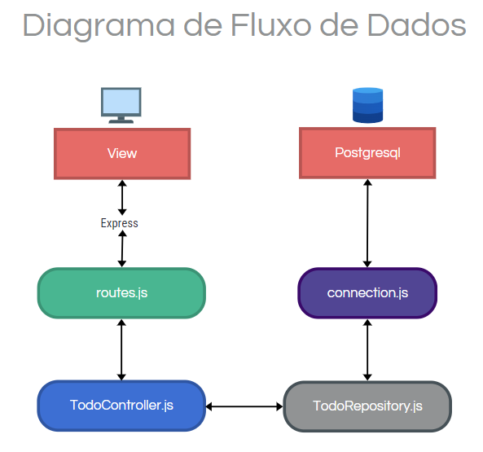

# CRUD API - Gerenciador de Atividades (To-do List) 📝

  Esta é uma API simples utilizando Node.js e React.js que permite realizar operações CRUD (Create, Read, Update, Delete) para gerenciar uma lista de tarefas (to-do list). A API deve suporta a criação de novas tarefas, listagem de todas as tarefas, atualização de uma tarefa existente e exclusão de uma tarefa.

*******
## Índice
- [Decisões técnicas 💻](#decisoes-tecnicas)
- [Instruções para configurar o ambiente de desenvolvimento 👓](#instrucoes)
- [Fluxo Detalhado da aplicação 🔄](#fluxo-aplicacao)
*******

<div id='decisoes-tecnicas'></div>
  
## Decisões técnicas 💻

  Abaixo estão as decisões técnicas realizadas no projeto

### Aplicação no geral

1. **Utilização da língua inglesa:**

    A nível do código, tudo nesta aplicação está em inglês. Optei por essa abordagem para garantir consistência já que, além do inglês ser adotado globalmente como uma língua padrão pela comunidade de software, comentários e nomes de variáveis em inglês são mais facilmente compreendidos, visto que não ocorre a transição de idiomas, evitando ambiguidades.

    Locais dentro do código que optei por não utilizar inglês:
    - **Mensagens de erro:** Visto que essas mensagens são muitas vezes enviadas para o usuário final, e estamos em um contexto de uma aplicação “brasileira”.
    - **Swagger:** Atributos e descrições dentro do Swagger estão também em português, pelo mesmo motivo do tópico anterior.

### Front-End

1. **Utilização de variáveis CSS**

   No CSS eu priorizei em deixar todas as cores em variáveis dentro do arquivo **index.css**, prezando uma melhor manutenção, legibilidade de código e consistência visual. Assim se torna mais fácil e rápido de alterar ou adicionar uma nova cor à paleta de cores, sem a necessidade de alterar diretamente o código de estilo em vários lugares.

2. **Componentização**

   Utilizei a componentização a fim de modularizar e organizar a estrutura da aplicação de forma com que melhorasse a legibilidade e reutilização de código. Ao dividir a interface do usuário em componentes independentes e reutilizáveis, pude criar uma arquitetura mais coesa e fácil de manter.

### Back-End

1. **Modularização do código e Padrão MVC:**

    No meu curso na universidade, vemos muitas cadeiras de back-end e, apesar de quase todas serem em Java, alguns conceitos a gente aprende e leva pra vida. Um desses conceitos é a modularização de código, particionando-o em partes menores e dividindo cada responsabilidade em seu respectivo módulo. A modularização tem como objeto melhorar a organização, manutenção e reutilização do código.

    Outro padrão bastante difundido no curso da gente é o Model-View-Controller (MVC). Sendo assim, resolvi utilizá-lo também neste projeto desta forma: 
    - Delegando o model para o Repository a fim de abstrair a lógica de acesso a dados.
    - Delegando o controller para o Controller, visando o intermédio da view com o model para um maior controle de fluxo de dados e manipulação de resposta para o usuário.
    - Delegando o view para o front-end da aplicação.

2. **Testes**

    Para os testes eu utilizei o Jest por conta da minha familiaridade com a ferramenta. Fiz a divisão de cada funcionalidade (create, getAll, getById, update e delete) em suas respectivas pastas, visando a organização.

<div id='instrucoes'></div>
  
## Instruções para configurar o ambiente de desenvolvimento 👓

  O que você vai precisar para rodar essa aplicação:
  - Node JS ☑️
  - Postgresql ☑️

  ### Postegresql

  Com o Banco de Dados Postgresql você irá:

  1. **Criar o banco**: Crie um banco chamado **todo_db** com comando `createdb` para criar um banco de dados PostgreSQL. Execute o seguinte comando no terminal:
   ```bash
       createdb todo_bd
   ```

  2. **Criar a tabela**: Crie uma tabela chamada **todos**. Execute os seguintes comandos SQL em seu banco de dados PostgreSQL:
  ```bash
      CREATE TABLE todos (
        id SERIAL PRIMARY KEY,
        title VARCHAR(255) NOT NULL,
        description TEXT,
        status VARCHAR(20) CHECK (status IN ('pending', 'in progress', 'completed')) NOT NULL,
        creation_date DATE DEFAULT CURRENT_DATE
      );
  ```
  3. **Inserir dados**: Caso desejar, pode inserir dados no banco com os comandos baixo:
  ```bash
    INSERT INTO todos (title, description, status, creation_date) VALUES
      ('Comprar mantimentos', 'Ir ao supermercado e comprar frutas, legumes e pão.', 'pending', '2024-05-01'),
      ('Consulta médica', 'Consulta anual com o clínico geral.', 'in progress', '2024-05-02'),
      ('Reunião de equipe', 'Reunião semanal com a equipe para discutir o progresso do projeto.', 'completed', '2024-05-03'),
      ('Pagar contas', 'Pagar a conta de luz e água.', 'pending', '2024-05-04'),
      ('Limpar a casa', 'Fazer uma faxina completa na casa.', 'in progress', '2024-05-05'),
      ('Estudar para prova', 'Estudar para a prova de matemática da próxima semana.', 'completed', '2024-05-06'),
      ('Enviar relatório', 'Enviar relatório mensal para o gerente.', 'pending', '2024-05-07'),
      ('Agendar dentista', 'Marcar consulta com o dentista para limpeza.', 'in progress', '2024-05-08'),
      ('Treino na academia', 'Ir à academia e fazer o treino de musculação.', 'completed', '2024-05-09'),
      ('Organizar escritório', 'Organizar e limpar o escritório em casa.', 'pending', '2024-05-10');
  ```

<div id='fluxo-aplicacao'></div>

## Fluxo Detalhado da aplicação 🔄

  Abaixo você encontra um diagrama de fluxo da aplicação, juntamente com textos informativos.

  <p align="center">
    
  </p>

### Requisição do Cliente:
- O usuário interage com a interface (por exemplo, criando uma nova tarefa).
- O frontend envia uma requisição HTTP para o backend.

### Recepção pelo Servidor:
- O servidor Express recebe a requisição.
- A requisição é roteada através de `routes.js` para o método apropriado no `TodoController`.

### Processamento pelo Controlador:
- O método do controlador (`store`, `index`, `show`, `update`, `delete`) é chamado.
- O controlador interage com o `TodoRepository` para realizar operações CRUD.

### Interação com o Banco de Dados:
- O `TodoRepository` chama a função `connectionQuery` para executar a consulta SQL.
- A `connectionQuery` utiliza a pool de conexões para comunicar-se com o PostgreSQL.

### Resposta do Banco de Dados:
- O PostgreSQL retorna o resultado da consulta.
- O `TodoRepository` processa o resultado e o retorna para o controlador.

### Resposta ao Cliente:
- O controlador envia a resposta apropriada de volta ao cliente.
- O frontend recebe a resposta e atualiza a interface do usuário conforme necessário.

